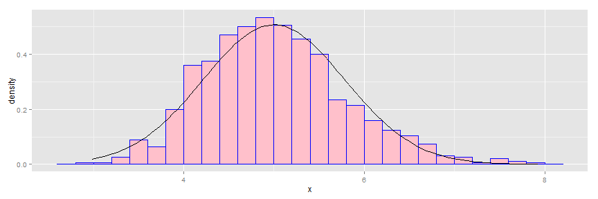

  
## Synopsis:
In this project you will investigate the exponential distribution in R and compare it with the Central Limit Theorem. The exponential distribution can be simulated in R with rexp(n, lambda) where lambda is the rate parameter. The mean of exponential distribution is 1/lambda and the standard deviation is also 1/lambda. Set lambda = 0.2 for all of the simulations. You will investigate the distribution of averages of 40 exponentials. Note that you will need to do a thousand simulations.


##Simulations

```r
set.seed(800)
lambda <- 0.2

# to investigate 40 samples based on 1000 simulations
nSam <- 40
nSim <- 1:1000

# average of 40 samples
Means <- data.frame(x = sapply(nSim, function(x) {
    mean(rexp(nSam, lambda))
}))
```

##Question 1
Mean of 40 samples is:
  

```r
mean(Means$x) 
```

```
## [1] 5.013284
```

Theoretical mean (1/lambda) is:

```r
1/lambda   
```

```
## [1] 5
```
1. The above results shows that the center of distribution of averages of 40 samples is close to the theoretical center of the distribution.


##Question 2
Variance of 40 samples is:

```r
var(Means$x)    
```

```
## [1] 0.6173955
```

Theoretical variance is:

```r
((1/lambda)/sqrt(nSam))^2   
```

```
## [1] 0.625
```
2. The above results shows that the computed variance is close to the theoretical variance of the distribution.

##Question 3

```r
library(ggplot2)
ggplot(data = Means, aes(x = x)) + geom_histogram(aes(y = ..density..), fill = I("pink"), 
    binwidth = 0.2, color = I("blue")) + stat_function(fun = dnorm, arg = list(mean = 5, 
    sd = sd(Means$x)))
```

 
3. The plot shows that the distribution is approximately normal.
